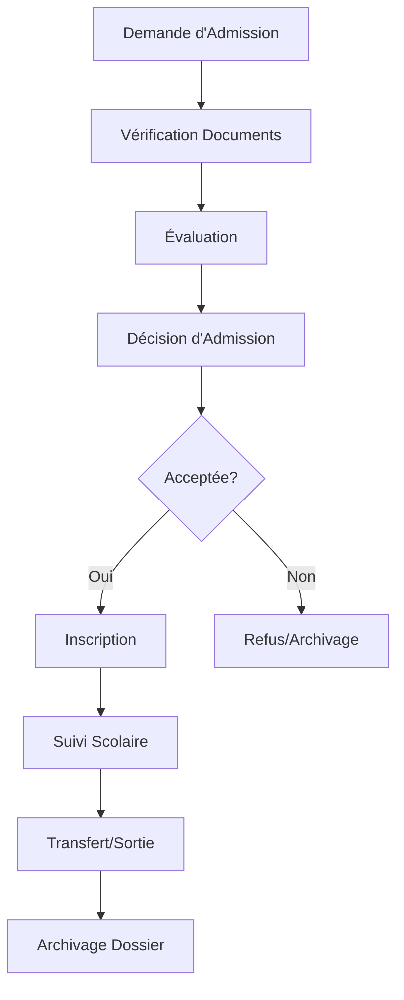

# Système de Suivi des Élèves - Educ-Sinfinity

## Vue d'ensemble

Le système de suivi des élèves d'Educ-Sinfinity est un processus complet et organisé en plusieurs étapes qui permet de gérer le parcours scolaire des élèves depuis leur demande d'admission jusqu'à leur sortie de l'établissement.

## Architecture du Système

### 1. Demande d'Admission
- **Objectif** : Enregistrer les informations d'un nouvel élève
- **Fonctionnalités** :
  - Saisie des données personnelles
  - Dossier scolaire
  - Pièces jointes (certificat de naissance, bulletin précédent, etc.)
  - Génération automatique d'un numéro de dossier unique
  - Attribution d'une priorité (normale, urgente, très urgente)

### 2. Évaluation
- **Objectif** : Évaluer les compétences et le profil de l'élève
- **Types d'évaluation** :
  - Test écrit
  - Entretien
  - Examen médical
  - Évaluation psychologique
  - Test de niveau
- **Fonctionnalités** :
  - Programmation des évaluations
  - Attribution d'évaluateurs
  - Saisie des résultats et notes
  - Décision provisoire (accepter, refuser, attendre, conditionnel)

### 3. Acceptation
- **Objectif** : Prendre une décision finale d'admission
- **Types de décisions** :
  - Acceptée
  - Refusée
  - Acceptation conditionnelle
  - Mise en liste d'attente
- **Fonctionnalités** :
  - Motif de la décision
  - Conditions spéciales
  - Frais d'inscription et de scolarité
  - Date limite de réponse

### 4. Inscription
- **Objectif** : Finaliser l'inscription de l'élève
- **Fonctionnalités** :
  - Choix de l'année scolaire
  - Attribution de classe et section
  - Définition des frais d'inscription
  - Historique des inscriptions
  - Création du compte élève

### 5. Gestion
- **Objectif** : Suivre la scolarité de l'élève
- **Fonctionnalités** :
  - Suivi des notes et moyennes
  - Gestion des absences
  - Suivi des paiements
  - Activités et sanctions
  - Rapports scolaires
  - Décisions de conseil de classe

### 6. Transfert/Sortie
- **Objectif** : Gérer la fin de scolarité
- **Types** :
  - Transfert vers une autre école
  - Sortie définitive
  - Exclusion
  - Abandon
- **Fonctionnalités** :
  - Enregistrement du motif
  - Documents remis
  - Historique complet du parcours
  - Archivage du dossier

## Structure de la Base de Données

### Tables Principales

#### `etapes_admission`
- Définit les étapes du processus d'admission
- Ordre et description de chaque étape

#### `suivi_etapes_admission`
- Suivi de l'avancement de chaque demande
- Statut de chaque étape (en attente, en cours, terminée, annulée)

#### `evaluations_admission`
- Détails des évaluations effectuées
- Résultats, notes et commentaires

#### `decisions_admission`
- Décisions prises pour chaque demande
- Motifs et conditions

#### `inscriptions_detaillees`
- Inscriptions finalisées avec tous les détails
- Historique des inscriptions

#### `suivi_scolaire`
- Suivi de la scolarité de l'élève
- Notes, moyennes, décisions de conseil

#### `transferts_sorties`
- Enregistrement des transferts et sorties
- Motifs et documents

## Modules du Système

### 1. Tableau de Bord Principal (`/modules/students/student-tracking/`)
- Vue d'ensemble du système
- Statistiques et indicateurs
- Actions rapides
- Demandes récentes

### 2. Gestion des Évaluations (`/modules/students/student-tracking/evaluations/`)
- Programmation des évaluations
- Saisie des résultats
- Gestion des évaluateurs
- Suivi des évaluations en cours

### 3. Gestion des Décisions (`/modules/students/student-tracking/decisions/`)
- Prise de décisions d'admission
- Gestion des acceptations/refus
- Conditions spéciales
- Historique des décisions

### 4. Suivi Scolaire (`/modules/students/student-tracking/follow-up/`)
- Suivi des élèves inscrits
- Gestion des notes et moyennes
- Décisions de conseil de classe
- Rapports de suivi

## Workflow du Processus

## Fonctionnalités Avancées

### Notifications Automatiques
- Alertes pour les évaluations en retard
- Rappels pour les décisions en attente
- Notifications de paiements en retard

### Rapports et Statistiques
- Progression par étape
- Taux d'acceptation
- Performances par classe
- Élèves en difficulté

### Gestion des Documents
- Upload et validation des pièces jointes
- Suivi du statut des documents
- Archivage automatique

### Historique Complet
- Traçabilité de toutes les actions
- Logs des modifications
- Audit trail complet

## Sécurité et Permissions

### Rôles Utilisateurs
- **Admin** : Accès complet au système
- **Directeur** : Prise de décisions, validation
- **Enseignant** : Évaluations, suivi scolaire
- **Secrétaire** : Gestion des demandes, inscriptions
- **Comptable** : Gestion des frais et paiements

### Contrôles d'Accès
- Authentification obligatoire
- Vérification des permissions par module
- Logs de toutes les actions
- Protection contre les modifications non autorisées

## Configuration et Personnalisation

### Paramètres Configurables
- Types d'évaluation
- Critères d'acceptation
- Frais par classe
- Durées limites
- Notifications

### Personnalisation de l'Interface
- Thèmes et couleurs
- Langues disponibles
- Formats de date et nombres
- Unités monétaires

## Maintenance et Support

### Sauvegarde
- Sauvegarde automatique quotidienne
- Sauvegarde avant mise à jour
- Récupération en cas de problème

### Monitoring
- Surveillance des performances
- Alertes en cas d'erreur
- Logs de système
- Métriques d'utilisation

### Mises à Jour
- Gestion des versions
- Migration automatique des données
- Tests de compatibilité
- Rollback en cas de problème

## Utilisation Recommandée

### Bonnes Pratiques
1. **Saisie des données** : Vérifier l'exactitude des informations
2. **Évaluations** : Planifier suffisamment de temps
3. **Décisions** : Documenter les motifs clairement
4. **Suivi** : Mettre à jour régulièrement les informations
5. **Archivage** : Respecter les procédures de fin de scolarité

### Workflow Recommandé
1. Traiter les demandes dans l'ordre chronologique
2. Programmer les évaluations en fonction de la disponibilité
3. Prendre les décisions dans un délai raisonnable
4. Suivre régulièrement la scolarité des élèves
5. Maintenir à jour l'historique complet

## Support et Formation

### Documentation
- Guide utilisateur complet
- Tutoriels vidéo
- FAQ en ligne
- Base de connaissances

### Formation
- Sessions de formation initiale
- Formation continue
- Support technique
- Communauté d'utilisateurs

### Contact Support
- Email : support@educ-sinfinity.cd
- Téléphone : +243 XXX XXX XXX
- Chat en ligne : Disponible sur le portail
- Tickets : Système de tickets intégré

---

*Documentation mise à jour le : <?php echo date('d/m/Y'); ?>*
*Version : 1.0*
*Éditeur : Équipe Educ-Sinfinity*
